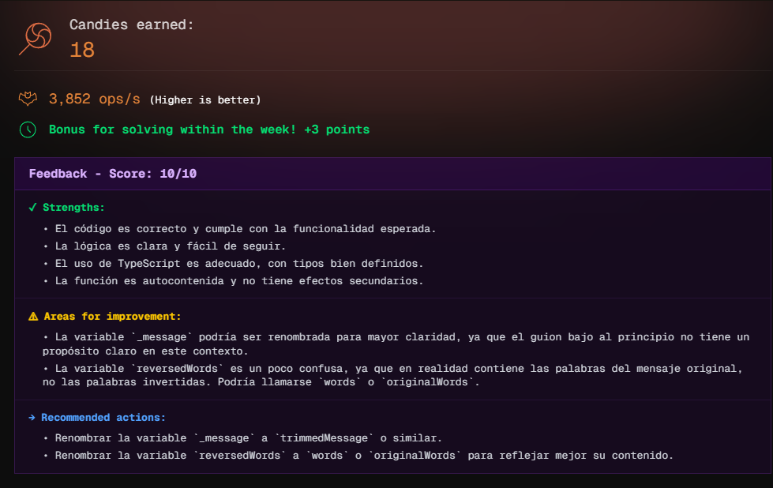

# Challenge 01

Regan has been possessed and now speaks in a strange language 😱. Father Karras has discovered that when Regan is possessed, **she completely reverses the words she says**, but keeps the order of the phrases.

Your mission is to create a program that translates Regan's possessed messages into normal human language.

```js
const message = 'i yojne gnihctaw uoy'
translatePossessed(message) // "i enjoy watching you"
```

## Examples

The spaces between words must be preserved:

```js
const message = 'siht si gnorw'
translatePossessed(message) // "this is wrong"
```

If the message is empty or contains only spaces, return an empty string:

```js
const message = '      '
translatePossessed(message) // ""
```

Words may contain uppercase and lowercase letters, and they should be preserved:

```js
const message = 'dooG secitcarP'
translatePossessed(message) // "Good Practices"
```

## Candies earned


