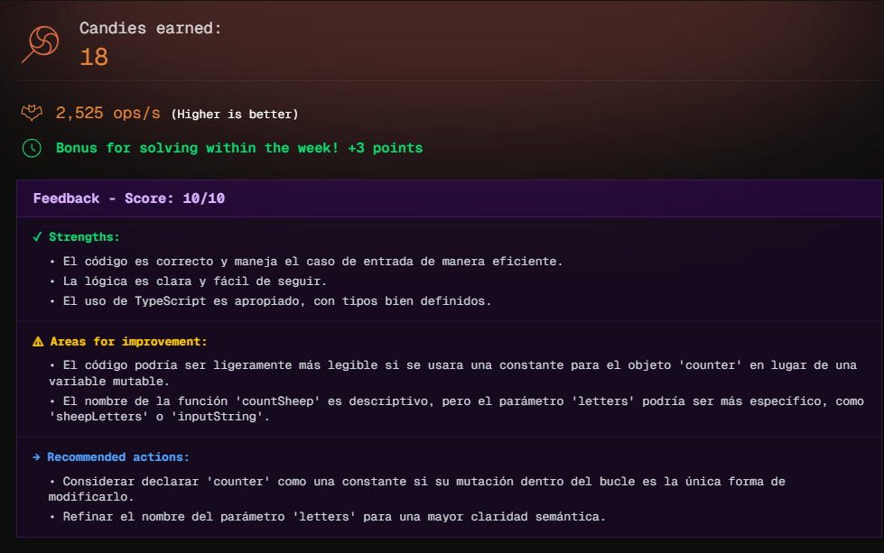

# Challenge 02

### Story

It's midnight on **Elm Street** and you desperately need to sleep. You try to count sheep, but the letters in your mind are completely **scrambled by Freddy**.

You have a chaotic string of text with mixed letters. Your only escape is to count how many times you can form the word **"sheep"** before Freddy catches you in the nightmare.

- **Your mission:** Count how many complete sheep you can form with the available letters.

### The Challenge

Create a function `countSheep(letters)` that:

- Receives a `string` with scrambled letters
- Counts how many times you can form the word "sheep"
- Returns the number of complete sheep you can count

**Important:** To form "sheep" you need: `s`, `h`, `e`, `e`, `p` (the `'e'` appears 2 times)

## Examples

```js
countSheep('sheepxsheepy')
// → 2 (you can form "sheep" twice)

countSheep('sshhheeeepppp')
// → 2 (s=2, h=3, e=4, p=4 → only 2 complete "sheep")

countSheep('hola')
// → 0 (not enough letters)

countSheep('peesh')
// → 1 (letters are scrambled but they're all there)
```

## Explanation

To form **"sheep"** you need:

- `s` → 1 time
- `h` → 1 time
- `e` → 2 times
- `p` → 1 time

If you have `"sshhheeeepppp"`:

- `s` = 2 (you can form 2 words)
- `h` = 3 (you can form 3 words)
- `e` = 4 (you can form 4÷2 = 2 words, because you need 2 'e' per "sheep")
- `p` = 4 (you can form 4 words)

**The result is the minimum:** `min(2, 3, 2, 4) = 2`

## Candies earned


