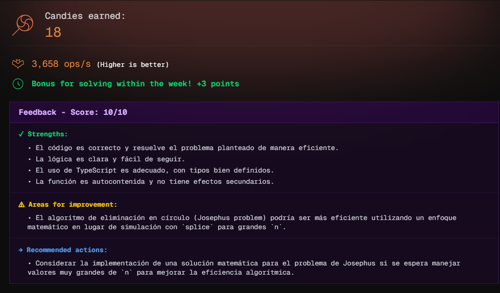

# Challenge 06

**Art the Clown 🤡** has captured some victims and seated them in a circle 🎪, numbered from `**`0`to`N-1`**`, where N is the number of victims.

**Art**, being a methodical clown in his madness, decides to play a "game". He starts at position 0 and counts **K victims clockwise** (including the current person in the count). The victim where the count ends is eliminated from the circle.

Then, **Art** continues counting K positions from the next living person. The process repeats until only one person remains.

In his twisted mind, Art wants to know: **Who will be the last survivor?**

Implement the function `surviveRoulette(victims, count)` that returns the position of the last victim to survive.

The input parameters are:

- `victims`: Total number of victims (seated in positions 0 to n-1)
- `count`: Number to count to eliminate the next victim

```js
surviveRoulette(4, 2)
// Result: 0

// Explanation:
// Start with 4 victims: [0, 1, 2, 3]
// Count 2 from position 0: eliminates 1 → [0, 2, 3]
// Count 2 from last victim: eliminates 3 → [0, 2]
// Count 2 from last victim: eliminates 2 → [0]
// Survivor: 0

surviveRoulette(5, 3)
// Result: 3

// Explanation:
// Start with 5 victims: [0, 1, 2, 3, 4]
// Count 3 from 0: eliminates 2 → [0, 1, 3, 4]
// Count 3 from 3: eliminates 0 → [1, 3, 4]
// Count 3 from 1: eliminates 4 → [1, 3]
// Count 3 from 1: eliminates 1 → [3]
// Survivor: 3

surviveRoulette(5, 10)
// Result: 3

// Explanation:
// Start with 5 victims: [0, 1, 2, 3, 4]
// Count 10 from 0: eliminates 4 → [0, 1, 2, 3]
// Count 10 from 0: eliminates 2 → [0, 1, 3]
// Count 10 from 0: eliminates 0 → [1, 3]
// Count 10 from 1: eliminates 1 → [3]
// Survivor: 3
```

> [!NOTE]
> This is a classic problem known as the "Josephus Problem". You must find an efficient solution, as `n` can be very large.`

Then, Art continues counting K positions from the next living person. The process repeats until only one person remains.

In his twisted mind, Art wants to know: **Who will be the last survivor?**

**The Challenge**: Implement the function surviveRoulette(n, k) that returns the position (0-indexed) of the last victim to survive.

**Input**:

- `n`: Total number of victims (seated in positions 0 to n-1)
- `k`: Every k-th victim is eliminated

**Output**:

- The index of the last victim to survive

## Examples

```js
surviveRoulette(4, 2)
// Result: 0

// Explanation:
// Start: [0, 1, 2, 3]
// Count 2 from position 0: eliminates 1 → [0, 2, 3]
// Count 2 from position 2: eliminates 3 → [0, 2]
// Count 2 from position 0: eliminates 2 → [0]
// Survivor: 0
```

```js
surviveRoulette(5, 3)
// Result: 3

// Explanation:
// Start: [0, 1, 2, 3, 4]
// Count 3 from 0: eliminates 2 → [0, 1, 3, 4]
// Count 3 from 3: eliminates 0 → [1, 3, 4]
// Count 3 from 1: eliminates 4 → [1, 3]
// Count 3 from 1: eliminates 1 → [3]
// Survivor: 3
```

```js
surviveRoulette(6, 2)
// Result: 4

// Explanation:
// Start: [0, 1, 2, 3, 4, 5]
// Round 1: eliminates 1 → [0, 2, 3, 4, 5]
// Round 2: eliminates 3 → [0, 2, 4, 5]
// Round 3: eliminates 5 → [0, 2, 4]
// Round 4: eliminates 2 → [0, 4]
// Round 5: eliminates 0 → [4]
// Survivor: 4
```

```js
surviveRoulette(1, 1)
// Result: 0

// Explanation:
// There is only one victim, therefore they survive
```

> [!NOTE]
> This is a classic problem known as the "Josephus Problem". You must find an efficient solution, as `n` can be very large.

## Candies earned


